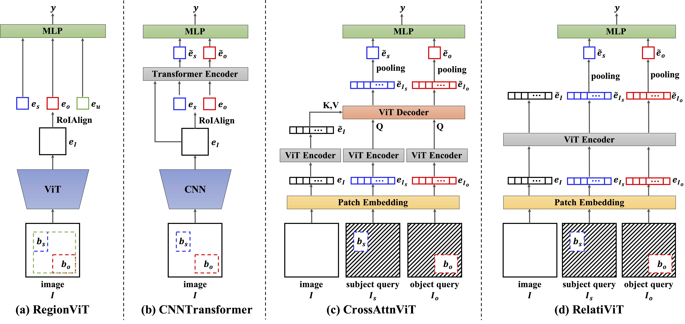

[**Can Transformers Capture Spatial Relations between Objects?**](https://arxiv.org/pdf/2403.00729)

[Chuan Wen](https://alvinwen428.github.io/), [Dinesh Jayaraman](https://www.seas.upenn.edu/~dineshj/), [Yang Gao](https://yang-gao.weebly.com/) <br/>
***International Conference on Learning Representation (ICLR) 2024***

This is the official codebase for ICLR 2024 paper [*Can Transformers Capture Spatial Relations between Objects?*](https://arxiv.org/pdf/2403.00729). This code is based on the [Rel3D repository](https://github.com/princeton-vl/Rel3D) (Great thanks to the authors).

# Getting Started

First clone our repository by 

```
git clone git@github.com:AlvinWen428/spatial-relation-benchmark.git
```

## Installation

### Use your own environment

This codebase is tested on Ubuntu 20.04 and CUDA 11.3.

We recommend [Miniforge](https://github.com/conda-forge/miniforge) for faster installation instead of Anaconda:

```
mamba create -n srp python=3.8
mamba activate srp
pip install -r requirements.txt
```

### Use with Docker

First build the docker image and tag it as spatial-relation:latest.

```
docker build . -t spatial-relation:latest
```

To start the container, you can use the following command:

```
docker run --gpus all --shm-size=8g -it \
-v $(pwd):/spatial-relation-benchmark \
spatial-relation:latest /bin/bash
```

## Download SpatialSense+, Rel3D Datasets, and the IBOT-pretrained ViT backbone.

Make sure you are in `spatial-relation-benchmark`, download.py can be used for downloading the SpatialSense+, Rel3D, and the IBOT pretrained backbone:

```
python download.py --data-key spatialsense+
python download.py --data-key rel3d
python download.py --data-key ibot
```
 
# Experiments

## Training

`main.py` is the entry of all experiments. All the experiment configs for training and evaluating all the models on SpatialSense+ and Rel3D can be found in `configs/`.
The training process can be executed by:

```
CUDA_VISIBLE_DEVICES=0,1,2,3 python -m torch.distributed.launch --master_port 10000 --nproc_per_node 4 python main.py --exp-config ${CONFIG_PATH} [Args1, Args2, ...]
```

We provide example scripts in `scripts/` to reproduce our Results of ***RegionViT***, ***CNNTransformer***, ***CrossAttnViT***, and ***RelatiViT***. We trained each model for 5 times with different random seeds and reported the average accuracy.

```
# Rel3D
python scripts/rel3d_regionvit.py
python scripts/rel3d_cnntransformer.py
python scripts/rel3d_crossattnvit.py
python scripts/rel3d_relativit.py

# SpatialSense+
python scripts/spatialsense_regionvit.py
python scripts/spatialsense_cnntransformer.py
python scripts/spatialsense_crossattnvit.py
python scripts/spatialsense_relativit.py
```




## Testing

If you have trained the models with the provided scripts in `scripts/`, the checkpoints and tensorboard files can be found in `results/`. Then, taking ***RelatiViT*** on *SpatialSense+* as an example, the average testing results over different random seeds can be computed by:

```
python main.py --entry batch-test --model-path results/spatialsenseplus_RelatiViT_seed*
```


# Citation

If you find our project useful, please consider citing our paper:
```
@inproceedings{
  wen2024can,
  title={Can Transformers Capture Spatial Relations between Objects?},
  author={Chuan Wen and Dinesh Jayaraman and Yang Gao},
  booktitle={The Twelfth International Conference on Learning Representations},
  year={2024},
  url={https://openreview.net/forum?id=HgZUcwFhjr}
}
```
